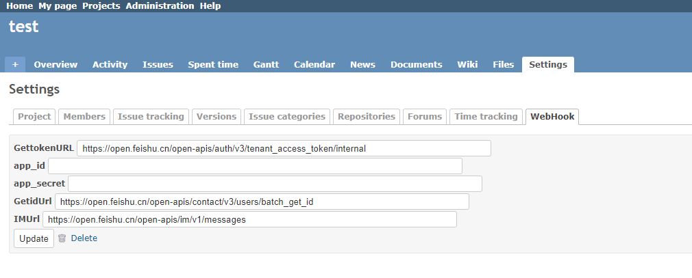

Redmine WebHook Plugin For FeiShu
======================

A Redmine plugin posts webhook to feishu on creating and updating tickets.

Thanks For [Redmine WebHook Plugin](https://github.com/suer/redmine_webhook)

Author
------------------------------
* @colin

Install
------------------------------
Type below commands:

    $ cd $RAILS_ROOT/plugins
    $ git clone https://github.com/Colins110/redmine_webhook_for_feishu.git
    $ bundle exec rake redmine:plugins:migrate NAME=redmine_webhook RAILS_ENV=production 

Then, restart your redmine.

How to Use
------------------------------
0. You need creat your own feishu robot to use this project.  
[自定义机器人指南](https://open.feishu.cn/document/ukTMukTMukTM/ucTM5YjL3ETO24yNxkjN)

1. In your Project's settings,tick the `Webhooks` Modules:

2. Enter FeiShu webhook url and certificate in webhooks's setting:

certificate info can get from [there](https://open.feishu.cn/document/ukTMukTMukTM/uMTNz4yM1MjLzUzM).
url can get from:
[GettokenURL](https://open.feishu.cn/document/ukTMukTMukTM/uMTNz4yM1MjLzUzM)
[GetidUrl](https://open.feishu.cn/document/uAjLw4CM/ukTMukTMukTM/reference/contact-v3/user/batch_get_id)
[IMUrl](https://open.feishu.cn/document/uAjLw4CM/ukTMukTMukTM/reference/im-v1/message/create)

Notice
------------------------------
We use user's email to identify who will be notified.So your must set a same email on redmine and feishu.
Redmine's email can be set on `My account` page.
You can read this [article](https://www.feishu.cn/hc/en-US/articles/360049067557) to set feishu's email.

Requirements
------------------------------
* Redmine 4.0 or later

Skipping webhooks
------------------------------
When a webhook triggers a change via REST API, this would trigger another webhook.
If you need to prevent this, the API request can include the `X-Skip-Webhooks` header, which will prevent webhooks being triggered by that request.

Known Limitations
------------------------------

An update from context menu doesn't call a webhook event.
It is caused by a lack of functionality hooking in Redmine.
Please see https://github.com/suer/redmine_webhook/issues/4 for details.

This limitation has been affected on all Redmine versions includes 2.4, 2.6,
and 3.0. It is not fixed in end of April, 2015.

License
------------------------------
The MIT License (MIT)
Copyright (c) suer

Permission is hereby granted, free of charge, to any person obtaining a copy of this software and associated documentation files (the "Software"), to deal in the Software without restriction, including without limitation the rights to use, copy, modify, merge, publish, distribute, sublicense, and/or sell copies of the Software, and to permit persons to whom the Software is furnished to do so, subject to the following conditions:

The above copyright notice and this permission notice shall be included in all copies or substantial portions of the Software.

THE SOFTWARE IS PROVIDED "AS IS", WITHOUT WARRANTY OF ANY KIND, EXPRESS OR IMPLIED, INCLUDING BUT NOT LIMITED TO THE WARRANTIES OF MERCHANTABILITY, FITNESS FOR A PARTICULAR PURPOSE AND NONINFRINGEMENT. IN NO EVENT SHALL THE AUTHORS OR COPYRIGHT HOLDERS BE LIABLE FOR ANY CLAIM, DAMAGES OR OTHER LIABILITY, WHETHER IN AN ACTION OF CONTRACT, TORT OR OTHERWISE, ARISING FROM, OUT OF OR IN CONNECTION WITH THE SOFTWARE OR THE USE OR OTHER DEALINGS IN THE SOFTWARE.
